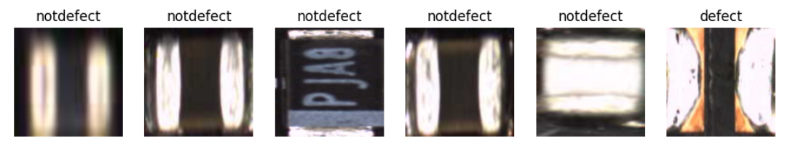
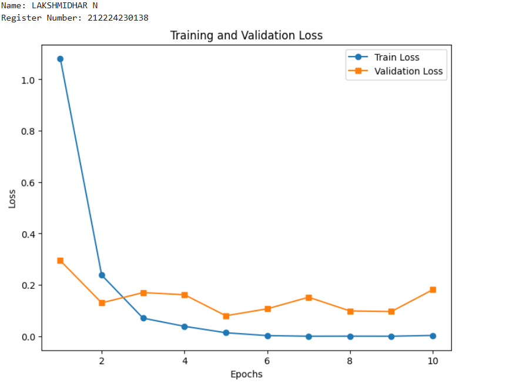
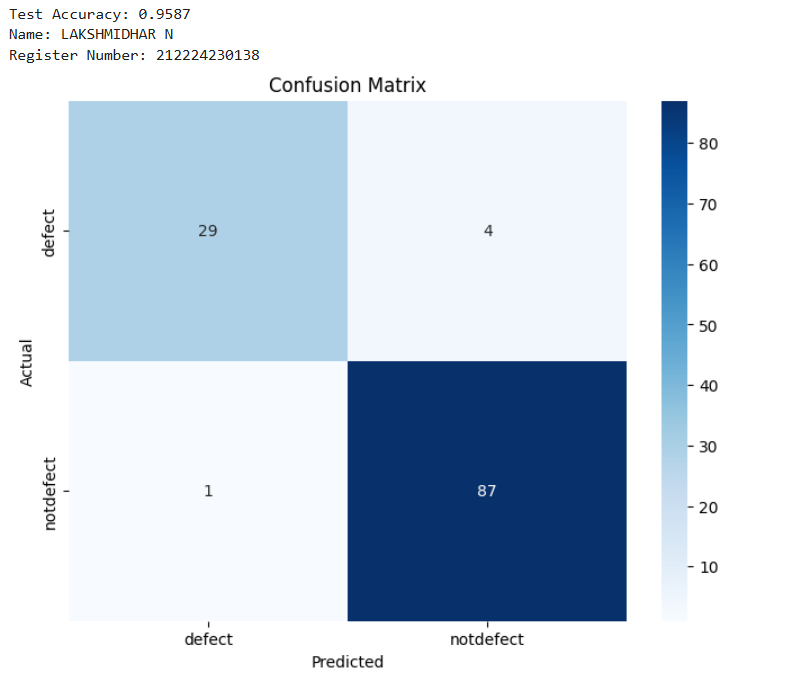
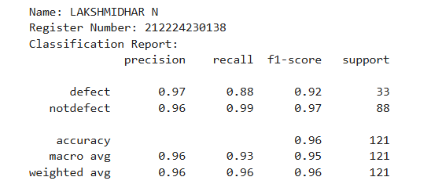
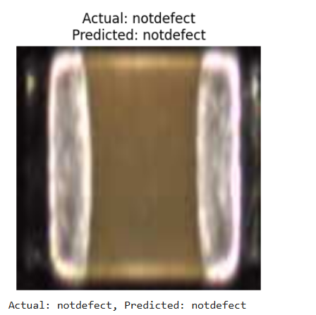

# DL- Developing a Neural Network Classification Model using Transfer Learning

## AIM
To develop an image classification model using transfer learning with VGG19 architecture for the given dataset.

## Problem Statement and Dataset

### Problem Statement:

To build and evaluate a deep learning–based image classification system using transfer learning with the VGG19 architecture to automatically classify images as defect or not defect.

### Dataset



## Neural Network Model


## DESIGN STEPS
### STEP 1: 

Write your own stepsLoad and preprocess the dataset using ImageFolder and apply required image transformations.

### STEP 2: 

Create DataLoaders for training and testing with appropriate batch size.

### STEP 3: 

Load the pretrained VGG19 model and modify the final fully connected layer for binary classification.

### STEP 4: 

Freeze feature extraction layers and define the loss function (BCEWithLogitsLoss) and optimizer (Adam).

### STEP 5: 

Train the model for multiple epochs while computing training and validation loss.

### STEP 6: 

Evaluate the model using sigmoid-based predictions and generate the confusion matrix and classification report.


## PROGRAM

### Name: LAKSHMIDHAR N

### Register Number: 212224230138

```python
# Load Pretrained Model and Modify for Transfer Learning

model = models.vgg19(weights=models.VGG19_Weights.DEFAULT)


# Modify the final fully connected layer to match the dataset classes

model.classifier[-1]=nn.Linear(model.classifier[-1].in_features,1)

# Include the Loss function and optimizer

criterion = nn.BCEWithLogitsLoss()
optimizer = optim.Adam(model.parameters(), lr=0.001)

# Train the model

def train_model(model, train_loader,test_loader,num_epochs=10):
    train_losses = []
    val_losses = []
    model.train()
    for epoch in range(num_epochs):
        running_loss = 0.0
        for images, labels in train_loader:
            images, labels = images.to(device), labels.to(device)
            optimizer.zero_grad()
            outputs = model(images)
            loss = criterion(outputs, labels.unsqueeze(1).float())
            loss.backward()
            optimizer.step()
            running_loss += loss.item()
        train_losses.append(running_loss/len(train_loader))

        print(f'Epoch [{epoch+1}/{num_epochs}], Train Loss: {train_losses[-1]:.4f}, Validation Loss: {val_losses[-1]:.4f}')

```

### OUTPUT

## Training Loss, Validation Loss Vs Iteration Plot



## Confusion Matrix



## Classification Report



### New Sample Data Prediction

```py
predict_image(model, image_index=55, dataset=test_dataset)
```



## RESULT

Thus, an image classification model was developed using transfer learning with the VGG19 architecture for the given dataset, achieving limited classification performance.
